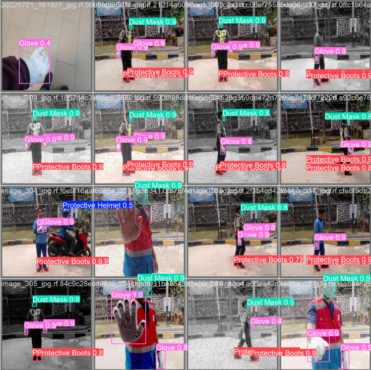

# PPE Detection

This project uses YOLOv8 and DeepSORT algorithms to detect and track personal protective equipment (PPE) in images and videos. It identifies safety gear such as helmets, vests, and masks to ensure compliance in various environments.



## Features

- **Real-time Object Detection**: YOLOv8 detects PPE items with high accuracy.
- **Object Tracking**: DeepSORT tracks detected objects across video frames.
- **Comprehensive PPE Identification**: Recognizes multiple PPE items including helmets, vests, and masks.

## Installation

1. Clone the repository:

    ```bash
    git clone https://github.com/MrAliAmani/PPE-detection.git
    cd PPE-detection
    ```

2. Install the dependencies:

    ```bash
    pip install -r requirements.txt
    ```

3. Download YOLOv8 model weights and place them in the `models/` directory.

## Usage

1. Run detection on an image or video:

    ```bash
    python detect.py --source path_to_image_or_video --output path_to_output
    ```

2. For real-time detection using a webcam:

    ```bash
    python detect.py --source 0 --output path_to_output
    ```

## Examples

### Image Detection


### Video Detection


## File Structure

- `detect.py`: Main script for detection and tracking.
- `models/`: Directory for YOLO model weights.
- `PPE-Detection-Final.ipynb`: Jupyter notebook for running experiments.

## Contributing

Contributions are welcome! Please fork the repo, create a branch, and submit a pull request.

## License

This project is under MIT license:

[](https://choosealicense.com/licenses/mit/)

## Feedback

If you have any feedback, please reach out to me at *<aliamani019@gmail.com>*.

## Authors

[@AliAmani](https://github.com/MrAliAmani)
